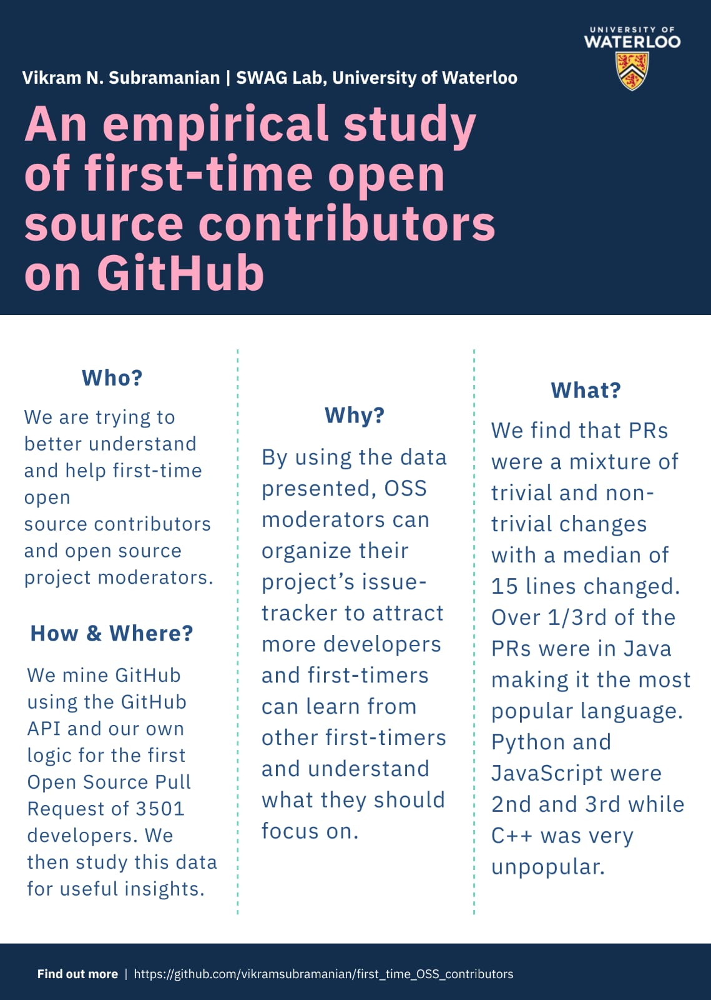

# An empirical study of first time open source contributors on GitHub
### Research paper accepted at ICSE2020
### Winner at ICSE2020 ACM Student Research Competition(Undergraduate)

Link to paper: [ACM](https://dl.acm.org/doi/abs/10.1145/3377812.3382165)

#### In the news 
1. [cs.uwaterloo.ca](https://cs.uwaterloo.ca/news/cheriton-faculty-members-graduate-undergraduate-students-win-four-awards-at-icse-2020)
2. [uwaterloo.ca](https://uwaterloo.ca/software-engineering/news/se-student-wins-acmicse-research-award)

#### Abstract

The popularity of Open Source Software (OSS) is at an all-time high and for it to remain so it is vital for new developers to continually join and contribute to the OSS community. In this paper, to better understand the first time contributor, we study the characteristics of the first pull request (PR) made to an OSS project by developers. We mine GitHub for the first OSS PR of 3501 developers to study certain characteristics of PRs like language and size. We find that over 1/3rd of the PRs were in Java while C++ was very unpopular. A large fraction of PRs didn’t even involve writing code, and that the PRs were a mixture of trivial and non-trivial changes.
